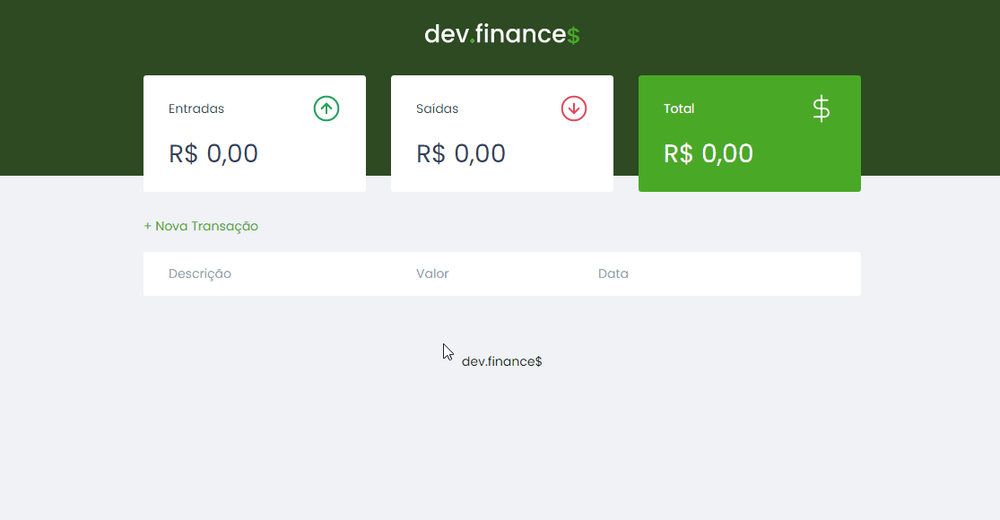

# *DEV FINANCE*
 

 

    

  

## 📕 About

The DEV FINANCE application was made during the Maratona Discover, commanded by the great @MaykBrito.

The application aims to register entries and exits to have a control of finances in general.
  

## 💻 Preview

    

  

## 🔨 Tools

- HTML
- CSS
- JavaScript
  

## 🙋🏽‍♂️ Author

### Enzo Alexsander